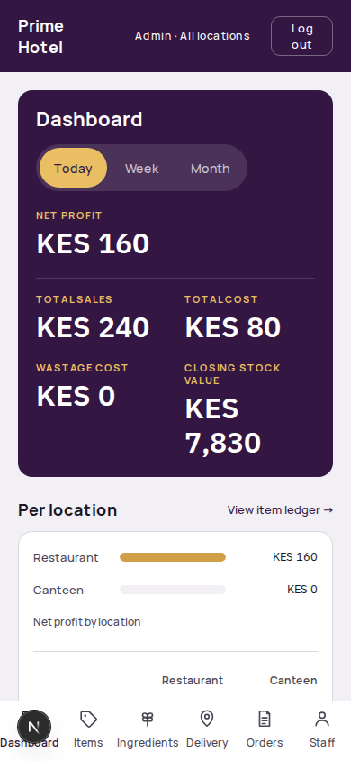
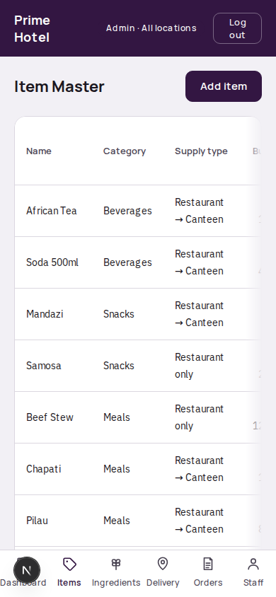
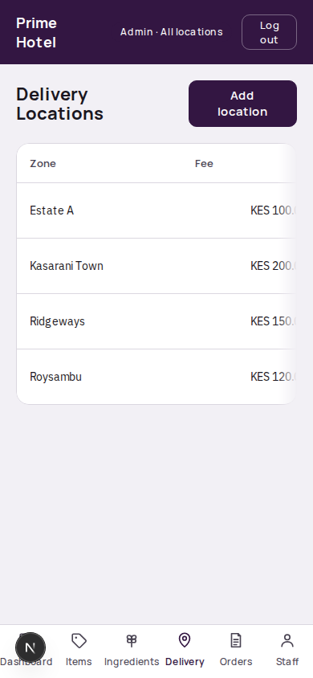
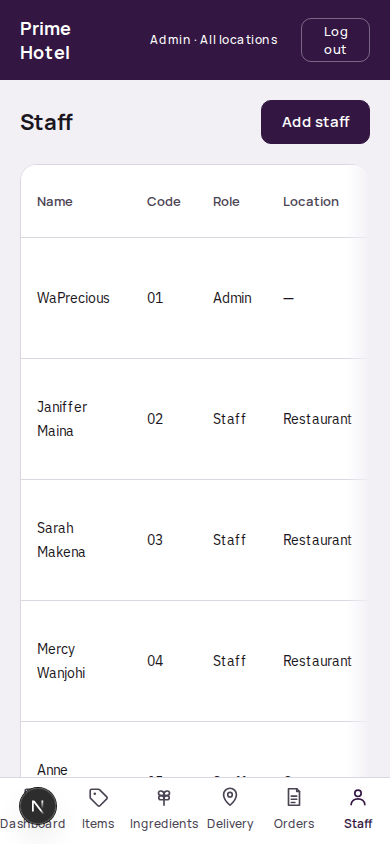

# Prosper Hotel — Admin Quick Reference (WaPrecious)

A short guide to the day-to-day admin tasks. For anything not covered here, ask Lobster Technologies.

---

## How do I check today's (or this week's, or this month's) profit?

1. Log in and you'll land on **Dashboard**.
2. At the top, tap **Today / Week / Month** to choose the period.
3. The dark card shows **Net Profit**, **Total Sales**, **Total Cost**, **Wastage Cost**, and **Closing Stock Value** for that period.
4. Below that, **Per location** shows the same split between Restaurant and Canteen, so you can see which location is driving the number.

**To see every entry behind those totals:** tap **View item ledger →** on the dashboard. This shows every stock and ingredient entry, row by row, for the period you picked.

---

## How do I see low-stock items?

Still on the **Dashboard**, scroll to **Needs attention**. Anything at or below its configured low-stock threshold shows up there automatically — you don't need to go looking through the catalog. If nothing is low, this section just says "All stocked up."

---

## How do I add a new menu item?

1. Go to **Items** (bottom nav).
2. Tap **Add item**.
3. Fill in name, category, buying price, selling price.
4. Choose **Supply type**:
   - **Restaurant only** — canteen never sees or sells this item.
   - **Restaurant → Canteen** — the restaurant sends some of this item to the canteen each day; the canteen's weekly stock for it fills in automatically from those transfers, so canteen staff never re-enter it.
   - **Canteen independent** — the canteen stocks and sells this item on its own (e.g. cyber services), with no restaurant-side involvement at all.
5. Set a **low-stock alert threshold** — this is the number that drives the "Needs attention" list on the Dashboard.
6. Save.

To edit or deactivate an item later, tap its row in the same table.

---

## How do I manage delivery zones and fees?

1. Go to **Delivery** (bottom nav).
2. Tap **Add location** to create a new delivery zone with its name and a fixed **fee (KES)**.
3. This fee auto-fills for staff whenever they log a delivery order to that zone — they never type a fee by hand.
4. Existing zones can be edited or deactivated from the same table.

---

## How do I manage staff — add, deactivate, reset a PIN?

1. Go to **Staff** (bottom nav).
2. Tap **Add staff** to create a new account: name, role (Staff/Admin), location (Restaurant/Canteen — staff only), and a 6-digit PIN.
3. If the person is the restaurant's store manager, tick **Store manager** — this unlocks the extra "Added stock" and "Sent to canteen" fields for them on the Entry screen, on top of normal cashier duties. It does not change what they can access anywhere else.
4. To deactivate someone who's left, open their row and switch **Active** off — this doesn't delete their history, it just stops them from logging in.
5. To reset a forgotten PIN, open their row and use **Reset PIN**.

---

## Quick reference — bottom nav

| Icon | Screen | What it's for |
|---|---|---|
| Dashboard | Profit, sales, cost, wastage, low-stock, per-location split |
| Items | Menu item catalog — prices, supply type, low-stock threshold |
| Ingredients | Raw-material catalog (restaurant only) |
| Delivery | Delivery zone names and fees |
| Orders | Every delivery/pickup order staff have logged |
| Staff | Accounts, roles, PINs |
