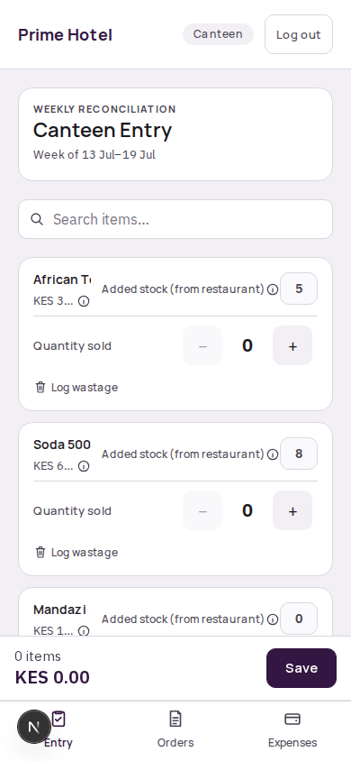
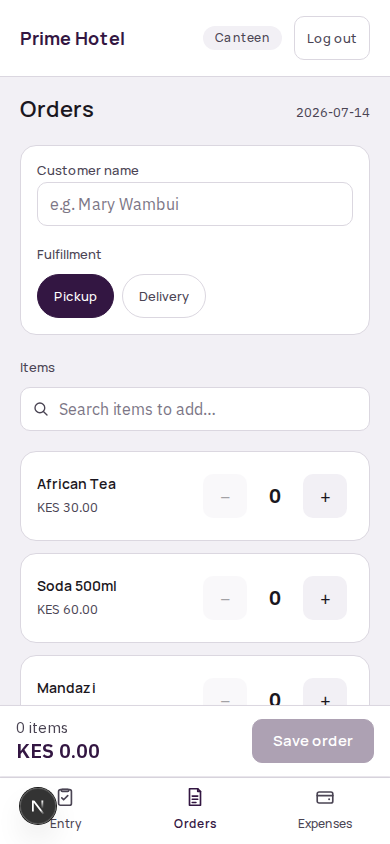
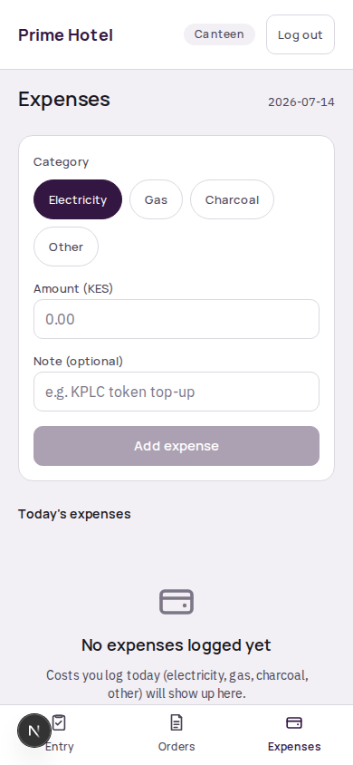

# Prosper Hotel — Canteen Staff Quick Reference (Anne)

Canteen works on a **weekly** cycle, not daily like the restaurant — you only need to do the main stock entry once a week.

---

## How do I do this week's stock entry?

1. Log in with your name and PIN. You'll land on **Entry**, which shows **Weekly reconciliation** and the current week's date range at the top.
2. For each item, you'll see **Opening** stock — carried forward automatically from last week's close, never something you type.
3. For items the restaurant supplies (most drinks and food items), **Added stock (from restaurant)** is already filled in and can't be edited — it's the total the restaurant sent over to the canteen that week, added up for you automatically. Tap the small **ⓘ** next to it if you want a reminder of why.
4. For items that are canteen's own (cyber services, certain retail lines the restaurant never touches), **Added stock** is a normal field you fill in yourself.
5. Record **Quantity sold** for the week using the **−** / **+** steppers.
6. If anything spoiled, broke, or was otherwise lost — not sold — tap **Log wastage** on that item and note how much, with a short note if you can.
7. Tap **Save** once you've gone through the list.

You don't need to keep a running tally of what the restaurant sent you during the week — that part is done for you. You're only responsible for what canteen sold and wasted.

---

## How do I log a delivery or pickup order?

Same as the restaurant side:

1. Go to **Orders** (bottom nav).
2. Enter the customer's name, choose **Pickup** or **Delivery** (pick a zone — the fee fills in automatically), then add items with the steppers.
3. Tap **Save order**.

This works day-by-day even though your main stock entry is weekly — orders you log any day this week are already counted toward the week's sales by the time you do Saturday's/Sunday's entry.

---

## How do I log an expense?

1. Go to **Expenses** (bottom nav).
2. Pick a category (Electricity, Gas, Charcoal, Other), enter the amount, and an optional note.
3. Tap **Add expense**.

---

## Quick reminders

- Canteen tracks **weekly**, restaurant tracks **daily** — if you're used to hearing about the restaurant's routine, don't expect to do stock entry every day here.
- You never need to ask the restaurant "how much did you send me this week?" — it's already totalled into your Added stock figures.
- Ingredients (raw cooking materials) aren't tracked on the canteen side at all — that's restaurant-only, done by the store manager.
