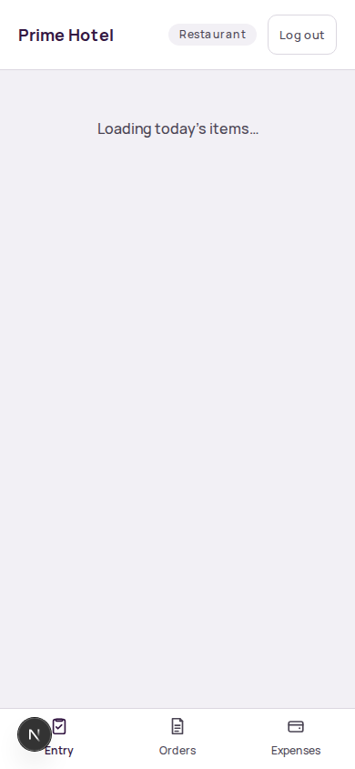
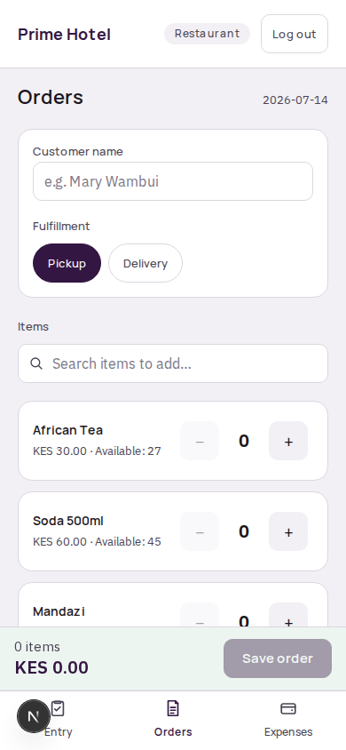
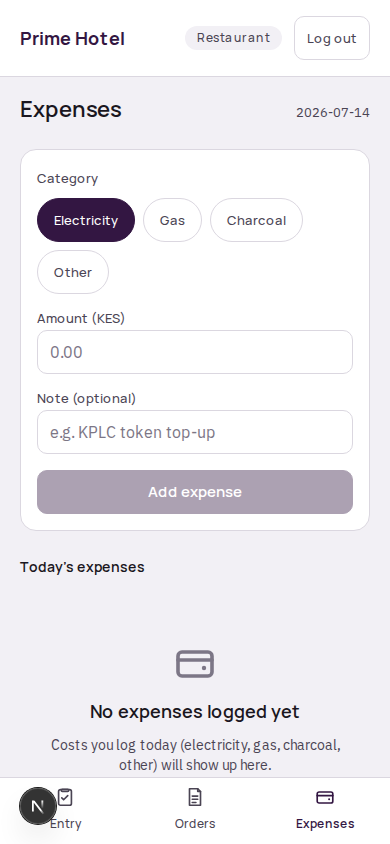
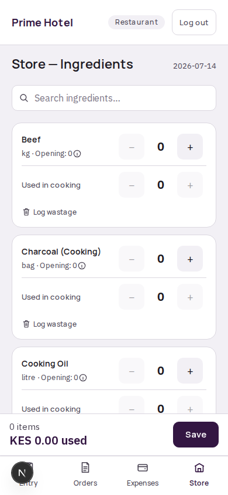
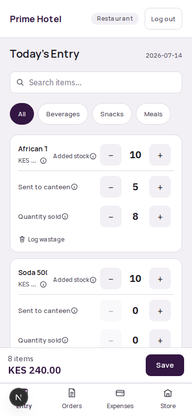

# Prime Hotel — Restaurant Staff Quick Reference

For Sarah, Mercy, and Janiffer. Janiffer has two extra sections marked **Store manager only**.

---

## How do I log today's stock/sales entry?

1. Log in with your name and PIN. You'll land on **Entry**.
2. Each item shows its price and how much is **Available** to sell — this is worked out automatically from yesterday's closing stock, so you never type an opening number.
3. Use the **−** / **+** buttons under **quantity sold** to record what sold at the till, as it happens through the day.
4. If something was lost to spoilage, breakage, or a mistake — not sold — tap **Log wastage** on that item's card and record how much, with a short note if you can.
5. When you're done, check the running total at the bottom and tap **Save**.

You can save more than once during the day — it adds up correctly either way, so don't worry about doing it in one sitting.

---

## How do I log a delivery or pickup order?

1. Go to **Orders** (bottom nav).
2. Enter the customer's name.
3. Choose **Pickup** or **Delivery**. For delivery, pick the zone from the dropdown — the fee fills in by itself, you don't type it.
4. Search for and add the items being ordered, using the steppers the same way as Entry.
5. Tap **Save order**.

Orders are counted in the day's sales alongside till sales automatically — you don't need to also add them to your Entry numbers.

---

## How do I log an expense?

1. Go to **Expenses** (bottom nav).
2. Pick a category: Electricity, Gas, Charcoal, or Other.
3. Enter the amount and an optional note (e.g. "KPLC token top-up").
4. Tap **Add expense**.

Today's expenses list at the bottom of the same screen so you can double-check what's already been logged.

---

## Store manager only — logging ingredient receiving/usage

Janiffer also has a **Store** screen (bottom nav) for raw ingredients — separate from menu items.

1. Go to **Store**.
2. For each ingredient, opening stock is carried over automatically from yesterday.
3. Log how much was **Received** from a supplier today, and how much was **Used in cooking**.
4. Log wastage the same way as Entry, if any ingredient spoiled or was wasted.
5. Tap **Save**.

This is tracked completely separately from menu items — there's no automatic link between how much beef you used and how many beef stew portions were sold. Log both, they don't calculate each other.

---

## Store manager only — the extra fields on Entry

On the main **Entry** screen, your cards show three fields instead of one:

- **Added stock** — how much of this item the kitchen produced/brought in today. Raises tomorrow's opening balance.
- **Sent to canteen** — how much you sent over to the canteen today. This becomes the canteen's stock for that item automatically — Anne doesn't re-enter it.
- **Quantity sold** — sales rung up at the till, same as any cashier.

Tap the small **ⓘ** next to any of these fields for a quick reminder of what it means.
